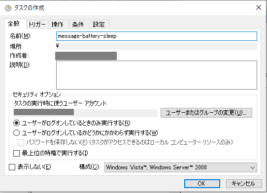
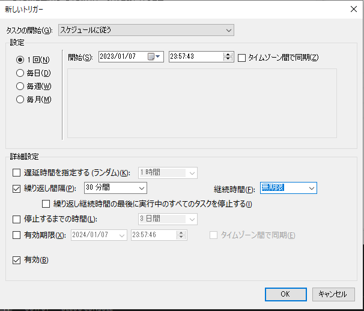
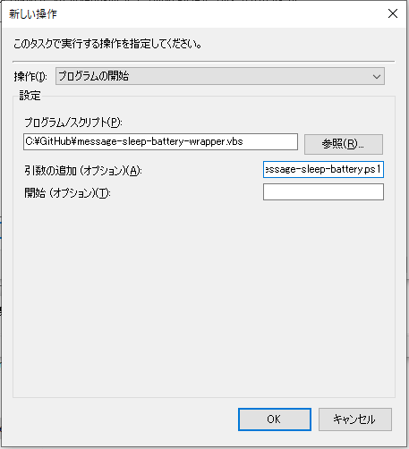
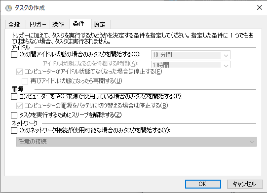

# action4threshold-battery

* タイトル
    * PowerShellでバッテリ残量を取得して、閾値未満で且つユーザー応答が無ければOSをスリープ状態へ移行する

# 概要

本リポジトリは、次の目的を達成する方法を説明します。

* WindowsモバイルノートPCをバッテリー駆動で利用中に寝落ちした場合、自動的にスリープ状態に移行する

実現に使うツールは以下とします。いずれもWindowsに標準搭載されています。

* タスクスケジューラ
* PowerShell

実現だけすればよい場合は、前半のスクリプトの解説を飛ばして、後半の「タスクスケジューラへの設定方法」の節を参照ください。

## 検証環境

「Windows 10」とします。


# 実現方法

次のようにして実現します。

1. タスクスケジューラで定期的に、監視用のPowerShellスクリプトを起動
2. PowerShellスクリプトでバッテリ残量を取得し（監視し）、閾値以下なら「作業を継続するか？」のダイアログを表示
3. ダイアログは一定時間で自動クローズする設定とし、応答なしだった場合は「寝落ちしている」と判断してOSをスリープ状態へ移行

## 監視用スクリプトの作成

PowerShellでバッテリー残量を取得するには、WMIが提供するWin32_Batteryクラスを利用して、次のようにします。
ここでは、後で表示に使うので「残り使用可能時間」も合わせて取得しておきます。

```
Get-CimInstance -ClassName Win32_Battery | Select-Object -Property DeviceID, EstimatedChargeRemaining, EstimatedRunTime | Foreach-Object {
  # $DeviceID = $_.DeviceID

  # 残バッテリ量(100-0％) 
  $EstimatedChargeRemaining = $_.EstimatedChargeRemaining

  # 残り使用可能時間(分)
  $EstimatedRunTime = $_.EstimatedRunTime
}

```

一定の表示時間で自動的に閉じるダイアログをPowerShellで表示するには、次のようにします。
ここではWscriptのポップアップを利用する方法とし、「はい」「いいえ」を表示するようにvbYesNoe (=4) を指定します。

```
  $wsobj = new-object -comobject wscript.shell
  $msgText = "表示するメッセージ"
  $nSecondsToWait = 5 # 表示する秒数
  $titleText = "タイトル文字列"

  $result = $wsobj.popup($msgText, $nSecondsToWait, $titleText, "4")
```

OSをスリープ状態へ移行するには、.Net FrameworkのSetSuspendStateを利用して、次のようにします。
```
Add-Type -Assembly System.Windows.Forms;[System.Windows.Forms.Application]::SetSuspendState(‘Suspend’, $false, $false);
```

以上の内容を用いて作成した、監視用のPowerShellスクリプトの
サンプルは [message-sleep-battery.ps1](./message-sleep-battery.ps1) のようになります。
以降は、こちらのスクリプトを用いるものとして説明します。


## タスクスケジューラへの設定方法

タスクスケジューラを起動して、次のようにタスクを設定します。
なお、手順中のスクリプトファイルは、任意の場所に格納した前提とします。

1. 「タスクの作成」を選択
2. タブ「全般」の「名前」に任意（例：message-battery-sleep等）の名称を入力
    * 他の項目はデフォルトのまま
    * 
3. タブ「トリガー」で「新規」ボタンを押します
4. 「新しいトリガー」ダイアログで「繰り返し間隔：30分間」と「継続時間：無期限」を設定して「OK」ボタンを押します
    * 
5. タブ「操作」で「新規」ボタンを押します
6. 「プログラム／スクリプト」に、PowerShellスクリプト、、、を起動するためのvbsスクリプトのパスを指定します
    * 直接PowerShell.exeを用いてスクリプトを実行しようとすると、「`-WindowStyle Hidden`」を指定しても、「スクリプトをウィンドウ非表示で起動する、ためのPowerShellウィンドウ」が起動してしまうため、代わりにvbsを経由することで、コマンドのウィンドウが表示されることを防ぎます
    * vbsスクリプトは [message-sleep-battery-wrapper.vbs](./message-sleep-battery-wrapper.vbs) のようにします
```
Set objWshShell = WScript.CreateObject("Wscript.Shell")
objWshShell.run "%SystemRoot%\System32\WindowsPowerShell\v1.0\powershell.exe -WindowStyle Hidden -ExecutionPolicy RemoteSigned -Command " & Wscript.Arguments(0), vbHide
```
7. 「引数の追加（オプション）」に、先に示した監視用のPowerShellスクリプト「[message-sleep-battery.ps1](./message-sleep-battery.ps1) 」へのパスを入力します
    * 
8. タブ「条件」で「コンピューターをAC電源で試用している場合のみタスクを開始する」のチェックを外します
    * 
9. 「タスクの作成」ダイアログの右下にある「OK」ボタンを押してタスクを保存します

タスクの定期実行が設定されました。

動作確認は、作成したタスクを選んで「実行」を押すことできます（スクリプト中のスクリプト中の「 `Set-Variable -Name THRESHOLD_BATTERY_CHARGE_REMAINING -Value 30 -Option Constant` 」に指定したバッテリー残量未満でない場合は、何も表示されません）。

以上で、設定は完了です。

30分おきに監視用のスクリプトが動作し、バッテリーの残量が閾値未満の場合（この例であれば「30％」未満の場合）に、利用者が寝落ちしていないか？を確認するダイアログが表示され、応答が無ければOSをスリープ状態へ移行します。


# この方法を選んだ背景

「寝落ちした場合に、自動的にスリープ状態へ移行して欲しい」を実現しようと考えた場合に、
OS標準の「バッテリーの設定＞電源とスリープ＞次の時間が経過後、PCをスリープ状態にする」
の設定で対応可能な場合が多いです。

ただ、上記の設定では「ブラウザゲームを再生中」や「Youtubeを再生中」における
「寝落ち」への対処は出来ません（スリープ状態へ移行しません）。
上記の「時間が経過」は「アイドル状態」を意図していると推定され、
「ゲームや動画を再生中」は「Notアイドル状態」と扱われるため
対象外のようです。

なので、上記以外の方法でスリープ状態へ持って行く必要があります。

最初に検討したのは「The Marvellous Suspender」で、一定時間の操作が無い場合に
Chromeブラウザをスリープさせてしまえば「アイドル状態」になるのでは？というアプローチでした。
しかし、残念ながら「The Marvellous Suspender」は
「アクティブでは無いタブをスリープさせる」なので適用は出来きませんでした。
アクティブに成っているタブは、表示状態のままとなります。

https://cravelweb.com/gadget/pc/how-to-setting-the-marvellous-suspender-google-chrome-extension


次に、タスクスケジューラの「トリガー」にある「アイドル状態の時」を利用する方法を
検討しましたが、これも結局は「Notアイドル状態、と判定されている」ために
動作しませんでした。

https://4thsight.xyz/37398


バッテリー監視系のソフトで、そのような機能を有するものが無いかを検索したところ、
一応「バッテリー状態をトリガーとしてタスクを実行する」機能を有するソフトはありました。
しかし、あくまでサブの機能であり、今回の目的のためだけにソフト導入するのは、出来れば見送りたい、
と考えたため、こちらは保留としました。

https://www.gigafree.net/system/monitor/Battery-Mode.html


ならば、ということで、バッテリー状態を監視して条件を満たしたら、スリープさせる
アプリをいっそのこと作ってしまえば、、、とも考えましたが、ソコまで労力をかけるのも、
出来れば見送りたい、と考えて保留としました。


と言うわけで、スクリプトとタスクスケジューラを組み合わせて何とかできないか？
と考えた結果に、今回の実現方法に辿り着いた、というのが背景と成ります。


なお、タスクスケジューラから実行時に、ウィンドウを非表示にするにはVBS経由とする
必要があるので、スクリプト自体をvbsで書くことも考えましたが（とりあえずは作成済み）、
OSをスリープ状態にするにはPowerShellが最適である、と言う背景から、
スクリプト本体はPowerShellとする、という判断をしました。

https://neos21.net/blog/2022/02/23-01.html


PowerShell（だけでなくvbsも）は、今回に初めて書いたので、「ｘｘと書いた方がより適切」
などの指摘があれば、コメントいただけると助かります。


# 本リポジトリ内のファイルの説明

* [message-sleep-battery.ps1](./message-sleep-battery.ps1)
    * 監視用のPowerShellスクリプト
* [message-sleep-battery-wrapper.vbs](./message-sleep-battery-wrapper.vbs)
    * タスクスケジューラからの起動時にウィンドウ非表示にするためのラッパーVBScriptファイル
* [archive/message-sleep-battery.vbs](./archive/message-sleep-battery.vbs)
    * VBScriptでの実装例（α版）


